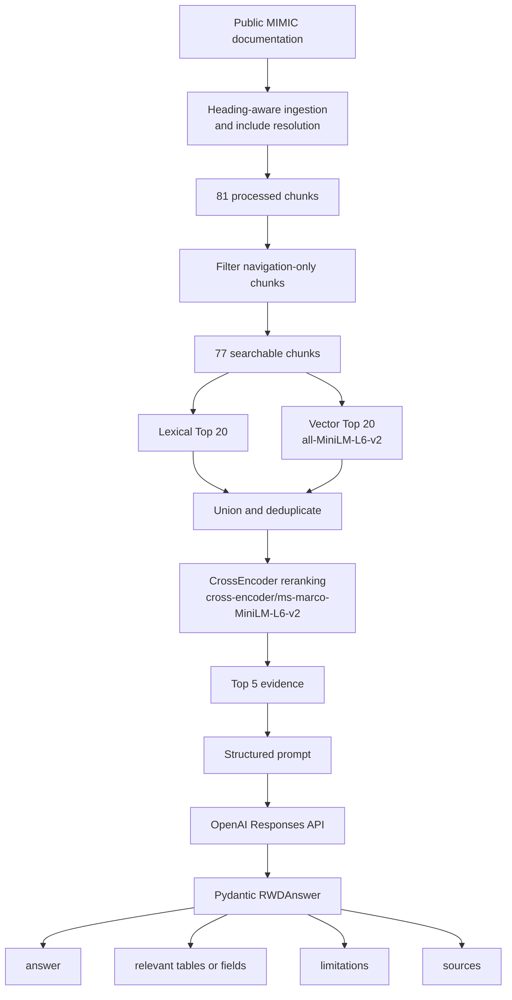

# RWD Data Asset & Methodology Copilot

An analyst-facing RAG prototype for navigating healthcare real-world data
documentation and answering questions about data definitions, tables, fields,
methodology, coverage, and documented limitations with auditable source
evidence.

Live demo: https://rwd-data-asset-copilot.streamlit.app

The current case study uses a selected, frozen subset of public MIMIC website
documentation. It does not include restricted MIMIC patient-level clinical data.

## Why This Matters

Healthcare analysts often need to translate a business or research question into
concrete data requirements before any analysis can be trusted:

```text
business or analytical question
-> relevant data assets
-> tables and fields
-> methodology and caveats
-> what the documentation supports or does not support
```

This prototype focuses on that documentation-navigation step. It helps an
analyst ask questions such as "which field captures this concept?", "what are
the limitations of this table?", or "does the documentation support this
quantitative claim?" while preserving source evidence for review.

## Example Questions

- What does `drug_type` mean?
- What caution does the admissions documentation give about organ donor
  accounts?
- What is the difference between `scheduletime` and `storetime` in eMAR?
- What percentage of prescriptions are marked Not Given?

The last example is intentionally useful as an abstention test: the selected
documentation does not provide the requested quantitative distribution, so the
system should avoid inventing a percentage.

## Architecture



The production Streamlit app uses the fixed RAG path above. An experimental
tool-calling prototype is kept separate from the production RAG application.

## Grounded Output Contract

Each answer is validated into a structured `RWDAnswer` with:

- `answer`
- `relevant_tables_or_fields`
- `limitations`
- `sources`

The UI also exposes the retrieved Top 5 evidence in a collapsed evidence panel
so a reviewer can inspect the source snippets used to form the answer. The
generation prompt instructs the model to answer only from retrieved evidence,
avoid filling unsupported gaps, distinguish documented limitations from
inference, and abstain when the available documentation is insufficient.

## Evaluation

The project uses separate development, regression, and final holdout evaluation
sets. The development sets informed retrieval and prompt iteration; the final
holdout was frozen separately before the final benchmark.

### Retrieval Development Benchmark

Evaluation set: 10 fixed analyst questions (`Q1`-`Q10`)

- Candidate recall: 10 / 10
- Two-stage retrieval with CrossEncoder reranking Hit@5: 10 / 10
- Final searchable corpus: 77 chunks

Retrieval path:

```text
Lexical Top 20 + Vector Top 20
-> candidate union
-> CrossEncoder reranking
-> Top 5 evidence
```

### Generation Development / Regression Benchmark

Evaluation set: 8 generation cases (`G1`-`G8`)

Deterministic checks:

- Schema validity: 8 / 8
- Source containment: 8 / 8
- Quantitative hallucination flags: 0
- Required abstention behavior: 2 / 2

Semantic judge checks:

- Overall pass: 8 / 8
- Average correctness: 2.00 / 2
- Average groundedness: 2.00 / 2
- Average completeness: 2.00 / 2
- Average source faithfulness: 2.00 / 2
- Average abstention: 2.00 / 2

### Final Frozen Holdout

Evaluation set: 5 final holdout cases (`F1`-`F5`)

- Deterministic checks: 5 / 5 schema valid and 5 / 5 source-contained
- Semantic checks: 5 / 5 overall pass
- Required abstention: 1 / 1
- Quantitative hallucination flags: 0

These are small, project-specific evaluation sets. They are useful for
regression testing this prototype, but they are not claims of domain-wide or
production-level accuracy.

## Reliability And Privacy

The Streamlit app includes lightweight local observability for reliability
diagnostics.

Runtime metadata may record:

- `request_id`
- latency
- success/error status
- retrieved evidence count
- retrieved source filenames

By default, runtime logs do not store:

- full user questions
- generated answer text
- retrieved evidence text
- prompts
- API keys or environment values

The app also supports simple helpful / not helpful feedback. Feedback events are
linked by `request_id`, and only one feedback event is stored per request.

Runtime logging and feedback are best-effort side effects. If local logging
fails, the primary RAG workflow should still return the answer. Local log files
under `logs/` are gitignored.

## Data Provenance

The reproducible corpus consists of selected public MIMIC website
documentation.

- Source repository: https://github.com/MIT-LCP/mimic.mit.edu
- Frozen upstream commit: `81822278432bc33e101116427e05fa4f69265a01`
- Selected main documentation files: 6
- Selected include files: 5
- Upstream MIT license retained under `data/third_party/`
- No restricted MIMIC patient-level clinical data is included

See `data/README.md` for the exact provenance notes and selected corpus
folders.

## Local Setup

Python 3.12 is recommended.

```powershell
git clone <repository-url>
cd rwd-data-asset-copilot
python -m venv .venv
.venv\Scripts\Activate.ps1
python -m pip install -r requirements.txt
```

Create a local `.env` file from the template:

```powershell
Copy-Item .env.example .env
```

Then set your local `OPENAI_API_KEY` in `.env`. Do not commit real API keys.

Launch the app:

```powershell
streamlit run app.py
```

The first query may be slower because the embedding model and reranker may need
to download and initialize if they are not already cached.

## Deployment Notes

The demo is deployed on Streamlit Community Cloud.

- Runtime: Python 3.12
- `OPENAI_API_KEY` is supplied through deployment secrets or environment
  configuration
- Hugging Face models are downloaded at runtime when not cached
- Local runtime logs are best-effort and should not be treated as durable cloud
  storage

## Current Scope And Limitations

Current v0.1 scope:

- Documentation QA, not patient-level analysis
- Selected MIMIC documentation subset only
- No claim of full MIMIC documentation coverage
- No SQL execution against clinical data
- No clinical decision support
- No production authentication or persistent monitoring backend
- Cloud cold starts may be slower because retrieval models initialize on demand

## Future Extension

A natural next extension is an RWD fitness-for-use and data-quality workflow
that combines documentation retrieval with structured schema inspection,
deterministic SQL or Python profiling, and data-quality metrics. That extension
is not implemented in the current production app.
